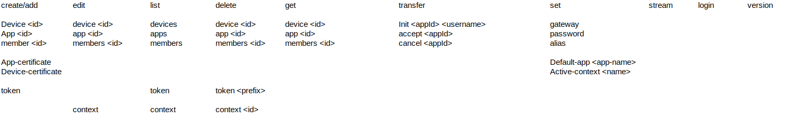

# Drg subcommands reference

Drg have several subsystems that allows to manage and interact with multiples components of drogue cloud.

## Applications

Drg can manage drogue cloud applications, edit their members and transfer applications ownership to other users.
Note: `app and apps` can be used interchangeably here.

- Create an application: `drg create app`
- Edit an application details: `drg edit app <appID>`
- Delete an application: `drg delete app <appID>`
- Read an application details: `drg get app <appID>`
- List applications: `drg list app`

### Certificates and trust anchors

Drg allows to create and add a trust anchor to an application, to use X509 authentications for devices of that application. 

- Generate a certificate and add it as a trust anchor : `drg trust create`

### Applications members and ownership transfer

Drg can manage applications members and their role : 
- Add a user to an application : `drg admin member add <appId> <username> --role <reader/manager/admin>`
- Edit members : `drg admin member edit <appId>`
- Initiate application ownership transfer : `drg admin tranfer init <appId> <username>`
- Accept an application ownership transfer : `drg admin tranfer accept <appId>`
- Cancel or decline application ownership transfer : `drg admin tranfer cancel <appId>`

## Devices

- Create a device: `drg create device <deviceId>`
- Delete: `drg delete device <deviceId>`
- Edit: `drg edit device <deviceId>`
- List: `drg list device`
- Read details: `drg get device <deviceId>`

### Shortcuts
- Set a gateway: `drg set gateway <deviceId> <gatewayId>`
- Add an alias: `drg set alias <deviceId> <alias>`
- Set a password credentials: `drg set password`

### Certificates

Drg handle the signing process for a device certificate using application's private key.

`drg trust enroll <deviceId> --ca-key <ca-key>`
Appart from adding an alias for the device this is not really a cloud operation, but rather a provisioning operation.  

## Consuming and sending commands

- Tapping into the websocket endpoint to receive application events: `drg stream <AppID>`
- Sending a command through the HTTP command endpoint: `drg cmd <command> <deviceId>`

## Access tokens management

`drg admin token`

- Create a new token : `create`
- Delete an existing token with it's prefix : `delete`
- List exising tokens prefixes: list : `list`

## Config 
- create a new context `drg login <drogue-cloud-api-url>`
- list stored contexts: `drg config list`
- delete a context: `drg config delete <contextName>`
- rename a context `drg config rename <contextName> <newName>`

Set default properties: 
- `drg config set-default-app <appId>`
- `drg-default-algo <algo>`

## Misc

- Version information: `drg version`
- Print cluster address, version and default app(if any): `drg whoami`

